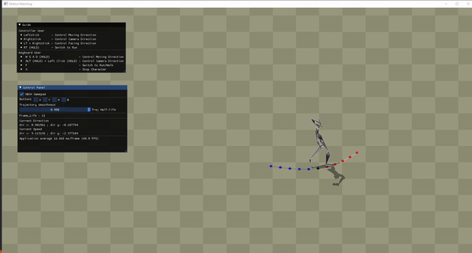

# Motion_Matching
A simple implementation of Motion Matching
Currently only involving trajectory match, still working in progress! Wait for it 

## How to run
Double Click `Demo/Motion_Matching.exe`

## Build from source
run `git submodule update --init` 
in folder **Motion_Matching** run `cmake -S . -B build`

## Preview

